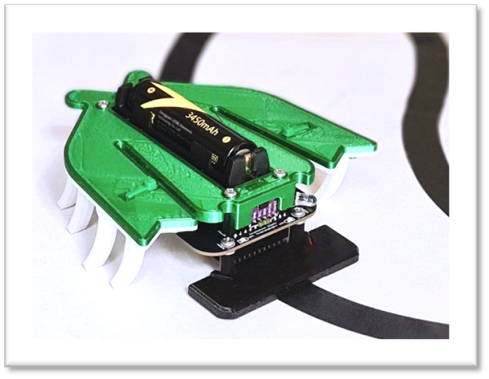
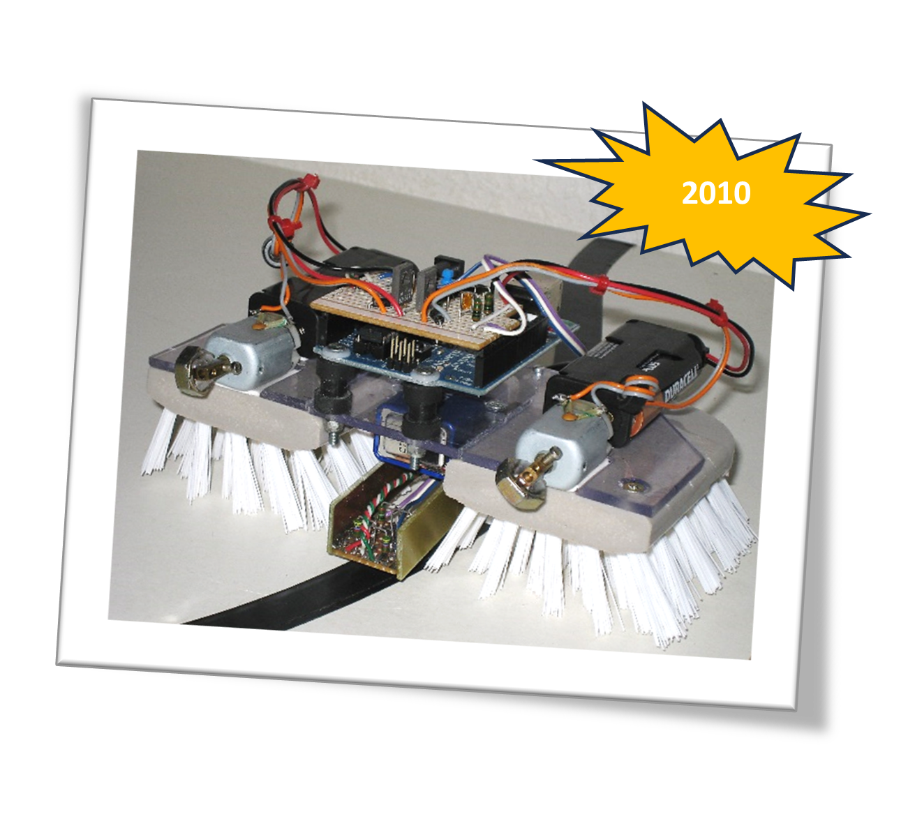
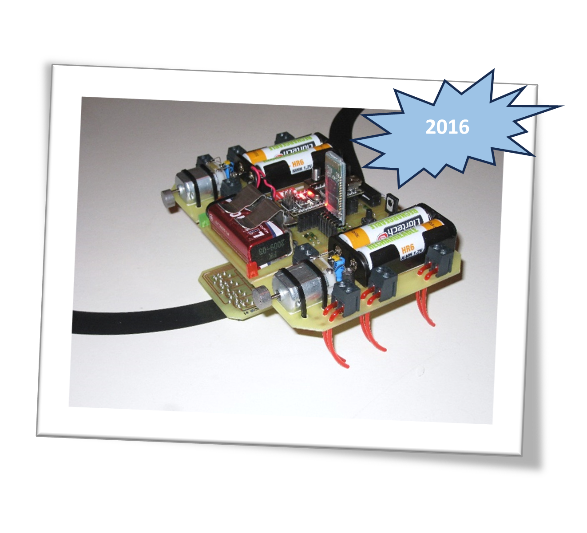

# TwinBristleBot
Vibration-driven locomotion robot  

# Présentation
La TBB#3 est la troisiéme génération d'un robot propulsé et dirigé par vibrations. Dans ce dossier vous trouverez toutes les informations pour le construire et le programmer en mode suiveur de ligne, mais on peut aussi le téléopérer par WiFi & Bluetooth. 

Vous trouverez une vidéo de démonstration au lien suivant :
https://youtu.be/ebChETA49Jo

# Historique
Le premier modèle de 2010 avait été conçu à l’aide d’une brosse à balais et un Arduino UNO. Il a fait l’objet d’un tutorial d’assemblage dans la revue Française Planète Robots N°11 à 13. Avec son aspect « SteamPunk » elle a parcouru de longues distances sur les salons.

La deuxième génération de 2016 avait pour objectif d’en faire un kit éducatif pour l’association Française de robotique Caliban https://www.facebook.com/AssoCaliban et pouvait être commandée en Bluetooth par un smartphone. Plus légère et plus rapide elle utilisait des filaments de coupe bordure pour se propulser. Mais son assemblage était assez laborieux et il y avait besoin de plusieurs grosses batteries.
 
  Vous retrouverez quelques démos de ces précédentes versions aux lien suivants : 
Twin BristleBot 2010 : https://youtu.be/IOm3nyDv1LA?si=ABxqIedQcTU6AHdo  
Twin BristleBot 2016: https://youtu.be/aQ-3ZJKfJKs?si=AR1gLndqPDY5ka6K

# Nouvelle version TBB#3
La version de 2024 est conçue en impression 3D PLA pour le corps et en TPU pour les pattes. 
  Tous les plans STL sont fournis.

Le robot est en plus équipé d’un module de télémétrie IR qui utilise la technologie Time Of Flight afin de détecter les obstacles devant lui tel qu'un autre robot ou une barriére. Les vibrations sont générées par deux micro-moteurs à masselottes M20 placés à droite et gauche sous le corps, ce qui permet aussi de le robot. Il a aussi en option la capacité d'émettre et recevoir un code d’indentification IR dont la portée est ajustable électroniquement pour s'identifier et faire évoluer plusieurs robots sur une piste avec croisements. Son module de commande utilise un objet IoT open-source T-Energy équipé d’un ESP32 WROVER-B 240MHZ et qui est alimenté par une batterie 3.7V Li-ion 18650. Le module comporte un connecteur micro USB pour la recharge et la programmation, ainsi qu’un interrupteur d’alimentation.

Pour faire le lien entre le module de commande et les autres composants tel que les moteurs et capteurs j’ai dessiné un PCB double face que j’ai fait réaliser en ligne par JLCPCB https://jlcpcb.com/, mais vous pouvez utiliser tout autre fournisseur.

 

Le schéma électronique, ainsi que le fichier Gerber, la BOM de composants et le fichier de placement des composants sont fournis. Pour ma part j’ai opté pour faire assembler les composants de surface SMD (Surface Mount Device), ce qui facilite l’assemblage car il reste à souder soi-même que les composants traditionnels traversants tels que les connecteurs… L’ensemble peut donc être approvisionné en ligne.

Le dossier comprend un manuel d’instructions pour l’assemblage et le démarrage, ainsi qu’un exemple de programme pour suivre une ligne et détecter des obstacles. 
J'espère que vous apprécierez construire ce robot et si c’est le cas n’hésitez pas à mettre une étoile sur le GitHub, ça fait toujours plaisir.
